<div align="center">

# LookOn

### AI-Powered Virtual Try-On

Take a photo of any garment and instantly visualize how it looks on you — without entering a fitting room.

<br>

[](https://flutter.dev)
[](https://dart.dev)
[](https://firebase.google.com)
[](https://riverpod.dev)
[](https://github.com/features/actions)

<br>

<p>
  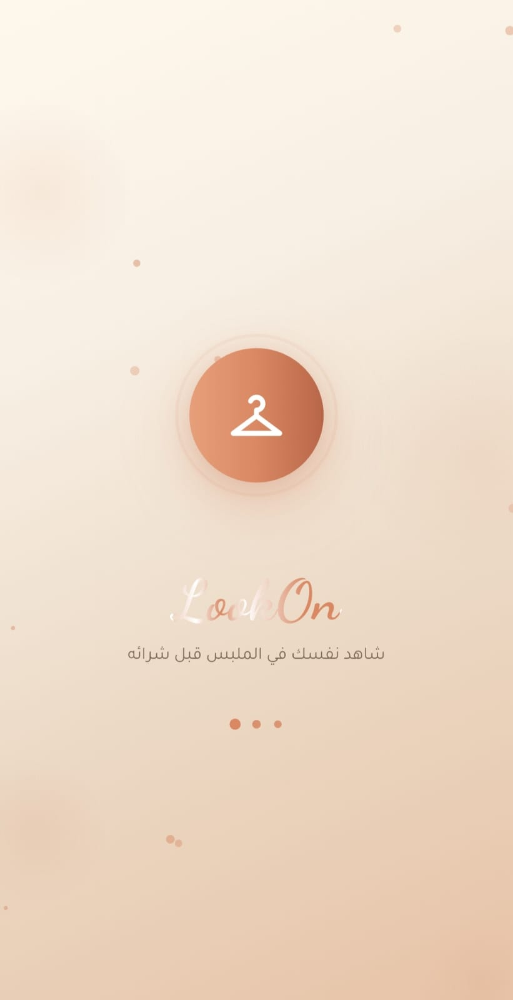
  &nbsp;
  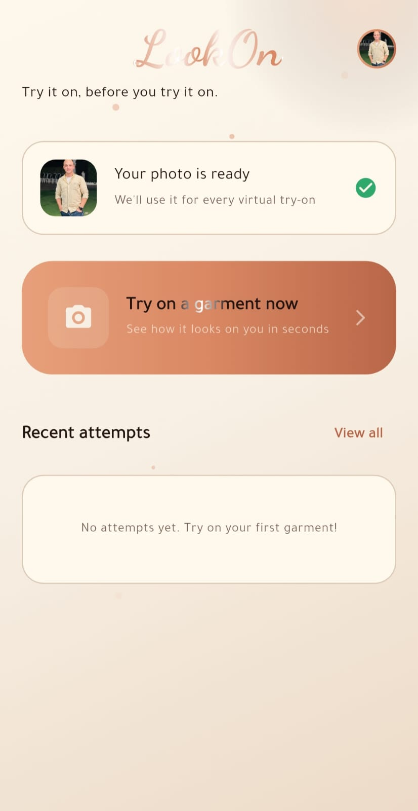
  &nbsp;
  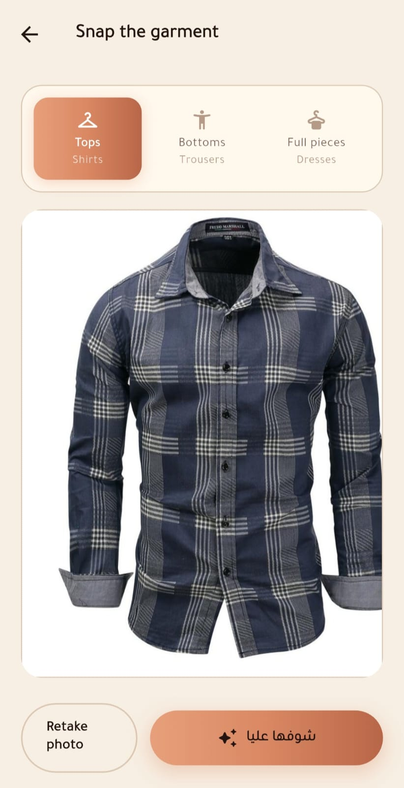
</p>

<br>

**Capture. Generate. Try it on virtually.**

</div>

---

## What It Does

LookOn transforms the in-store clothing experience into a fast virtual try-on workflow.

1. The user captures a one-time profile photo.
2. The user photographs a garment, including tops, bottoms, dresses, or full-body pieces.
3. AI generates a realistic result showing the user wearing the selected garment.
4. The generated image is saved and can be revisited, favorited, or shared.

---

## Features

| Feature                             | Description                                                                                       |
| ----------------------------------- | ------------------------------------------------------------------------------------------------- |
| **AI Virtual Try-On**               | Generates realistic clothing previews using FASHN.ai through fal.ai.                              |
| **Multiple Garment Categories**     | Supports tops, bottoms, dresses, jumpsuits, and other full-body garments.                         |
| **Automatic Language Detection**    | Opens in Arabic when the device language is Arabic and in English otherwise.                      |
| **Arabic and English Localization** | Complete RTL and LTR support across the entire application.                                       |
| **One-Time Onboarding**             | Saves language, gender, and garment preferences for future sessions.                              |
| **Favorites and History**           | Stores generated results and allows users to mark preferred items as favorites.                   |
| **Optional Measurements**           | Supports height, weight, chest, waist, shoulder width, and preferred clothing size.               |
| **Daily Usage Limits**              | Controls AI generation usage per user to manage service costs.                                    |
| **Offline Detection**               | Displays a global real-time banner whenever the internet connection is lost.                      |
| **Custom Design System**            | Uses a Coffee Cream identity with gradients, shimmer effects, animations, and micro-interactions. |
| **Consent-First Experience**        | Requires explicit terms and privacy acceptance before storing user photos.                        |

---

## Tech Stack

| Layer                | Technology                            |
| -------------------- | ------------------------------------- |
| **Framework**        | Flutter and Dart                      |
| **State Management** | Riverpod                              |
| **Backend**          | Firebase                              |
| **Authentication**   | Firebase Anonymous Authentication     |
| **Database**         | Cloud Firestore                       |
| **Image Storage**    | Supabase Storage                      |
| **AI Provider**      | FASHN.ai through fal.ai               |
| **Routing**          | go_router                             |
| **Localization**     | Custom Arabic and English i18n system |
| **CI/CD**            | GitHub Actions                        |

---

## Architecture

LookOn follows a **feature-first Clean Architecture** approach.

Each feature is isolated and organized into presentation, application, data, and domain layers. Shared infrastructure is placed inside the `core` directory.

```text
lib/
├── core/
│   ├── constants/
│   ├── errors/
│   ├── localization/
│   ├── providers/
│   ├── router/
│   ├── services/
│   ├── theme/
│   └── widgets/
│
├── features/
│   ├── onboarding/
│   ├── home/
│   ├── profile_photo/
│   ├── try_on/
│   ├── result/
│   ├── history/
│   ├── measurements/
│   ├── user_profile/
│   └── preferences/
│
└── main.dart
```

### Feature Structure

```text
feature/
├── presentation/
│   ├── screens/
│   └── widgets/
│
├── application/
│   ├── providers/
│   └── notifiers/
│
├── data/
│   ├── repositories/
│   └── data_sources/
│
└── domain/
    ├── models/
    ├── entities/
    └── enums/
```

| Layer           | Responsibility                                       |
| --------------- | ---------------------------------------------------- |
| `presentation/` | Screens, reusable widgets, and user interface logic  |
| `application/`  | Riverpod providers, notifiers, and business logic    |
| `data/`         | Repository implementations and external data sources |
| `domain/`       | Models, entities, enums, and repository contracts    |

---

## Screenshots

### Onboarding & Setup

<p align="center">
  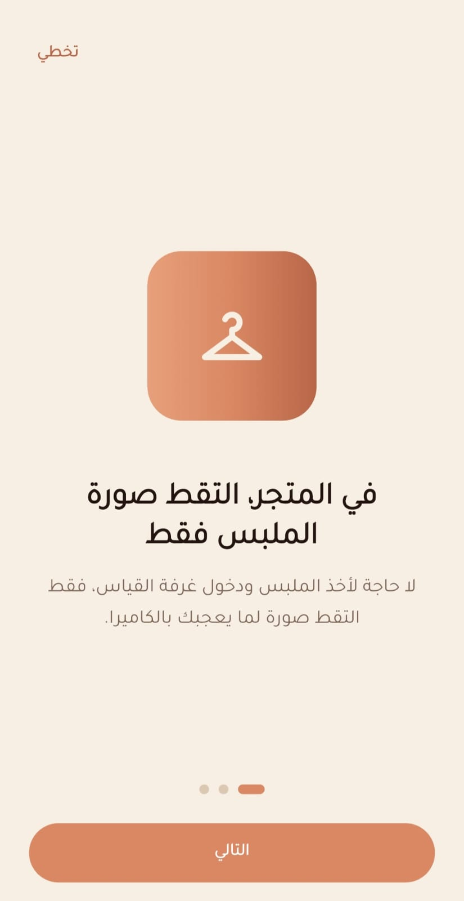
  &nbsp;
  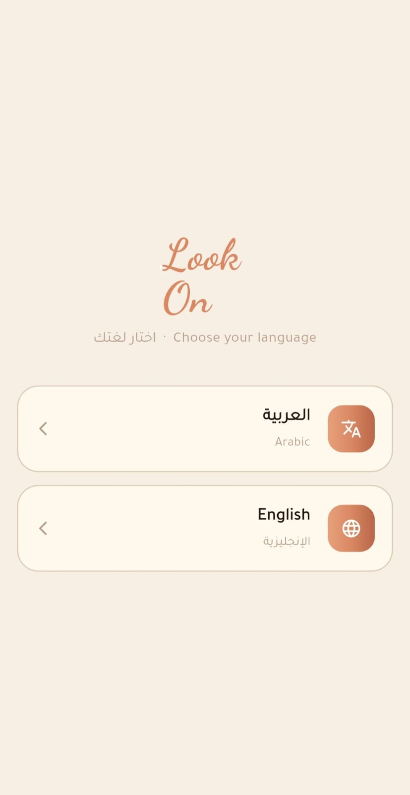
  &nbsp;
  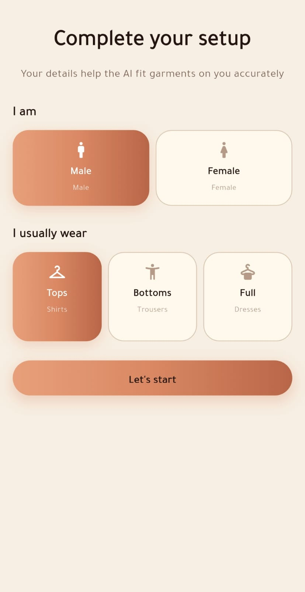
</p>

### Home — Arabic & English

<p align="center">
  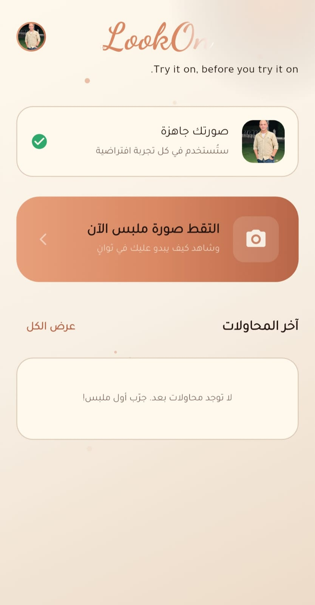
  &nbsp;
  
</p>

### Try-On Flow

<p align="center">
  
  &nbsp;
  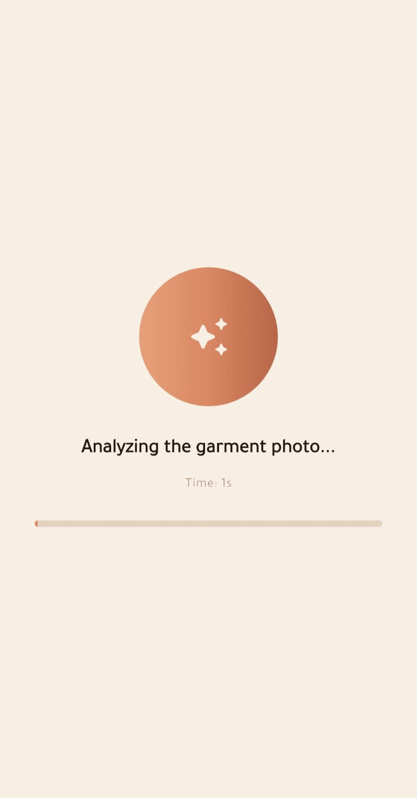
</p>

### History & Measurements

<p align="center">
  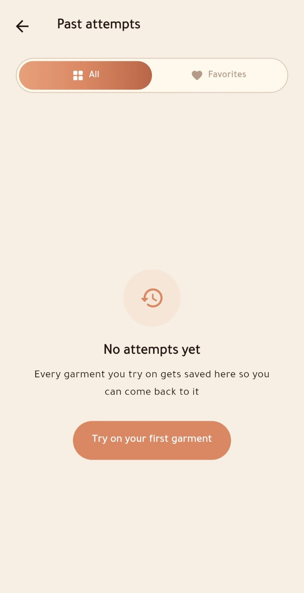
  &nbsp;
  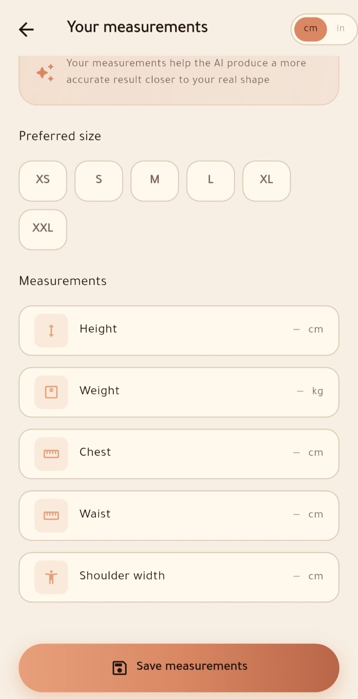
</p>

### Profile — Arabic & English

<p align="center">
  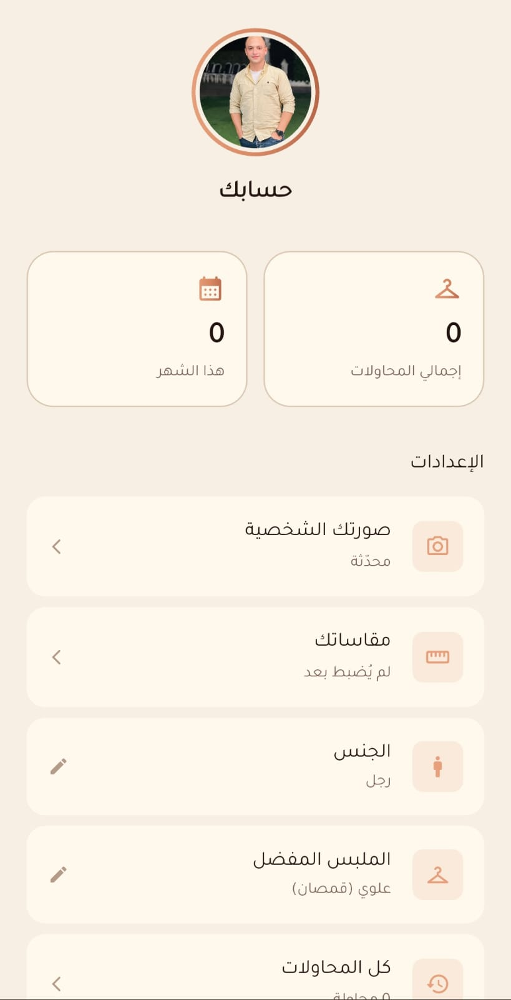
  &nbsp;
  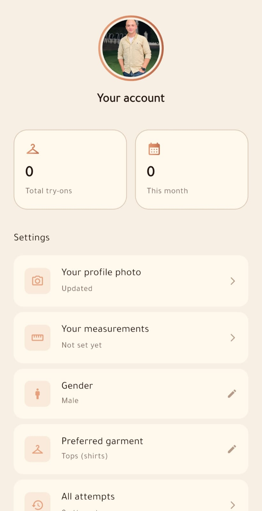
</p>

---

## CI/CD

Every push or pull request targeting the `main` branch triggers the GitHub Actions workflow.

```text
Push or Pull Request
          │
          ▼
Install Dependencies
          │
          ▼
Verify Formatting
          │
          ▼
Analyze Source Code
          │
          ▼
Run Automated Tests
          │
          ▼
Build Release APK
          │
          ▼
Upload APK Artifact
```

The generated Android APK can be downloaded from the workflow run under the **Artifacts** section.

---

## Author

<div align="center">

### Ahmed Gad Aljamal

Flutter Developer

[](https://github.com/AhmedAljamal15)
[](https://github.com/AhmedAljamal15/look-on-app)

<br>

**GitHub Profile:**
https://github.com/AhmedAljamal15

**Project Repository:**
https://github.com/AhmedAljamal15/look-on-app

</div>

</div>
